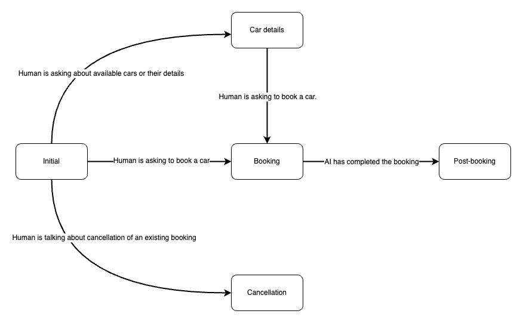

# Introduction
`agentic_chat_statemachine` is a python package that allows multi-agent architectures but in a precisely controlled manner. You define the entire conversation states and branches in a json file and `agentic_chat_statemachine` will ensure that the right chain/agents are handling the chat at the right points in time. Unlike the more common multi-agent orchestration systems, this approach allows you to benefit from the better performance of multi-agent systems and at the same time retain precise control on how the conversation flows and branches out. This may be paarticularly important for user facing apps where the bots need to follow runbooks precisely.

# Features
- Specify the entire statemachine as a json file.
- Serialize and Deserialize to support serverless architectures.
- Branch against human as well as AI messages.
- Both conditional and unconditional branching.
- Support for automatic confirmation while branching.
- Each state can use any kind of LangChain chain object including linear ones, agents or even custom Runnables.

# How to use
You can use `agentic_chat_statemachine` as a standard python package with any Langchain app. Start by importing the `agentic_chat_statemachine` package into your code, then create an instance of the `ChatStatemachine` class while providing your statemachine definition as well as the corresponding Langchain chains. 

Checkout the `car_rental_chat.py` file for an example of how to do this. It demonstrates how this package can be used to implement a chat bot for a car rental company. It has multiple chains(Will be agents in a real application) which are activated according to the definitions of the statemachine json file. 

# Running the sample
The accompanying example implements a simple customer support bot for a fictional car renting company with a conversation flow as in the below image. All states have a branch going back to initial as well, which is not shown here for brevity. Each state has a chain/agent that specializes is handling the conversation about that subject.



### Prerequisites
1. An AWS account with access to Amazon Bedrock and Anthropic Claude 3.5 Sonnet V2. Other models on bedrock also would work, but then you have to update the model ID and IAM policies accordingly.
2. A Python3 virtual environment where the script can be run after installing the dependencies specified in `requirements.txt`.

### ⚠️ Precautions ⚠️
Before you begin using the solution, there are certain precautions you must take into account:

- Cost Management with Bedrock: Be mindful of the costs associated with AWS resources.

- This is a sample code and hence the code provided in this repository shouldn't be used for production workloads without further reviews and adaptation.

- This is sample code, and users should conduct their own due diligence before using it. IAM permissions should follow the Principle of Least Privilege. See the [IAM best practises](https://docs.aws.amazon.com/IAM/latest/UserGuide/best-practices.html ).

### Executing
You can run the sample script easily from a terminal by followng the below steps:
1. Set the AWS region and model ID as env variables.
    ```
    export BEDROCK_REGION=us-west-2
    export BEDROCK_MODEL_ID=anthropic.claude-3-5-sonnet-20241022-v2:0
    ```
2. Ensure that the scrips running in the terminal can access AWS Bedrock and call invokeModel action.
3. Install the dependencies. (Better to do this in a python virtual environment.)
    ```
    pip install -r requirements.txt
    ```
4. Run the script, and begin chatting. (You can see the detailed logs and that the active-chain changes according to the statemachine definition.)
    ```
    python car_rental_chat.py 
    ```

# JSON definition
The json definition includes all states the chat would ever be in as well as all the transitions between these states. Both states and transitions are expressed in natural language and `agentic_chat_statemachine` uses LLM to make the right branching decisions on your behalf. Have a look at the json used by the same to develop a better understanding of the same. The intial state is specified against the `initial_state` key and all states are listed against the `states` key. Every state has a list of `branches`, and each branch specifies the target state as well as the `condition` under which the branching should occur.

Note that `condition` is optional for a branch and when omitted the branch becomes an unconditional one that immediately moves on to the next step after invoking the chain for that state just ones.

The boolean flag `confirmation` can be used with a branch to enable the `agentic_chat_statemachine` ask for user confirmation before branch off to the target. The process of getting the confirmation itself can be a muti-turn conversation and it is automatically handled for you.

There is another boolean flag named `afterwards` which makes the branching condition to be evaluated after the chain for that state has been invoked. It is useful for making branches based on a response from the AI instead of the message from the human.

When a branching happens, new human input is awaited before invoking the chain of the new state. However you can use the `needs_human_input` flag with a false value in a state to indicate that the new state should be invoked immediately with the last available human input. This can be handy in certain cases where unconditional transfer is needed, or when returning back to the initial state, in which case, we normally would want to respond based on the last human message but using the new state's chain.

Note that unlike the `before` branches(The normal ones), the `after` branches(Which run after AI has replied) are not automatically chained, as it makes little sense to have wated for the AI if we branching was not conditional.

## API
`ChatStateMachine` class is the only item exposed from the package and it includes all the avaialbe APIs. The table below lists the avaiable APIs in this class its description.
| Month    | Savings |
| -------- | ------- |
| set_state | Hydrate this statemachine from a serialized data. This is useful when deploying on to stateless platforms like AWS Lambda. |
| get_state | Get a serialized representation of this statemachine's current state. |
| get_messages | Get all messages. |
| send_message | This is the primary API and it process a new message from the human. This message as well as AI's reply will be added to the set of all messages. |

# Contributing
See [CONTRIBUTING](CONTRIBUTING.md) for more information.

# License
This library is licensed under the MIT-0 License. See the [LICENSE](LICENSE) file.
